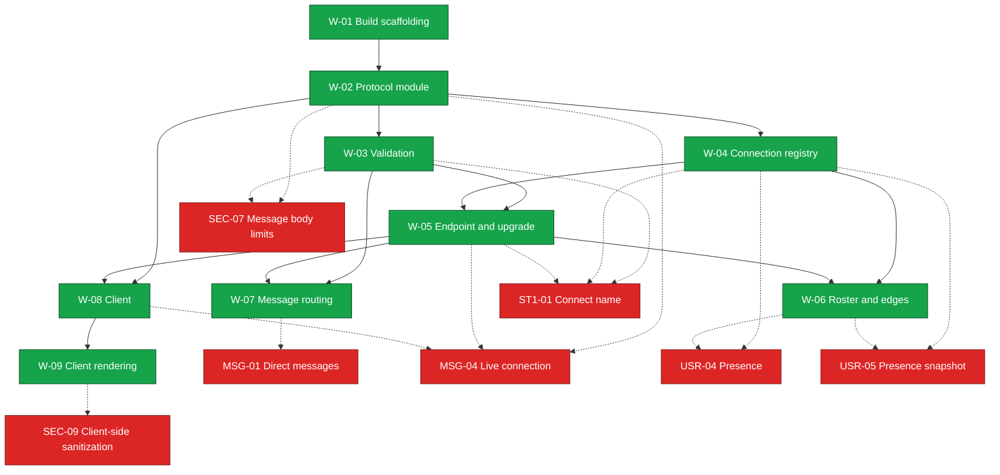
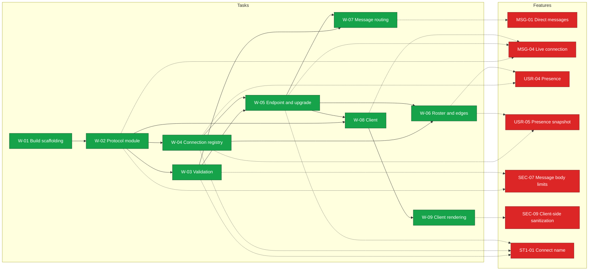

# Step 1 dependency map

## By depth

```mermaid
graph TD
  W01[W-01 Build scaffolding]
  W02[W-02 Protocol module]
  W03[W-03 Validation]
  W04[W-04 Connection registry]
  W05[W-05 Endpoint and upgrade]
  SEC07[SEC-07 Message body limits]
  W06[W-06 Roster and edges]
  W07[W-07 Message routing]
  W08[W-08 Client]
  ST101[ST1-01 Connect name]
  W09[W-09 Client rendering]
  MSG01[MSG-01 Direct messages]
  MSG04[MSG-04 Live connection]
  USR04[USR-04 Presence]
  USR05[USR-05 Presence snapshot]
  SEC09[SEC-09 Client-side sanitization]

  W01 --> W02
  W02 --> W03
  W02 --> W04
  W02 --> W08
  W03 --> W05
  W03 --> W07
  W04 --> W05
  W04 --> W06
  W05 --> W06
  W05 --> W07
  W05 --> W08
  W08 --> W09
  W07 -.-> MSG01
  W02 -.-> MSG04
  W05 -.-> MSG04
  W08 -.-> MSG04
  W04 -.-> USR04
  W06 -.-> USR04
  W04 -.-> USR05
  W06 -.-> USR05
  W02 -.-> SEC07
  W03 -.-> SEC07
  W09 -.-> SEC09
  W03 -.-> ST101
  W04 -.-> ST101
  W05 -.-> ST101

  classDef task fill:#16a34a,stroke:#14532d,stroke-width:1px,color:#ffffff
  classDef feature fill:#dc2626,stroke:#7f1d1d,stroke-width:1px,color:#ffffff
  class W01,W02,W03,W04,W05,W06,W07,W08,W09 task
  class SEC07,ST101,MSG01,MSG04,USR04,USR05,SEC09 feature
```

## Grouped by kind

```mermaid
graph LR
  subgraph Tasks
    W01[W-01 Build scaffolding]
    W02[W-02 Protocol module]
    W03[W-03 Validation]
    W04[W-04 Connection registry]
    W05[W-05 Endpoint and upgrade]
    W06[W-06 Roster and edges]
    W07[W-07 Message routing]
    W08[W-08 Client]
    W09[W-09 Client rendering]
    W01 --> W02
    W02 --> W03
    W02 --> W04
    W02 --> W08
    W03 --> W05
    W03 --> W07
    W04 --> W05
    W04 --> W06
    W05 --> W06
    W05 --> W07
    W05 --> W08
    W08 --> W09
  end

  subgraph Features
    MSG01[MSG-01 Direct messages]
    MSG04[MSG-04 Live connection]
    USR04[USR-04 Presence]
    USR05[USR-05 Presence snapshot]
    SEC07[SEC-07 Message body limits]
    SEC09[SEC-09 Client-side sanitization]
    ST101[ST1-01 Connect name]
  end

  W07 -.-> MSG01
  W02 -.-> MSG04
  W05 -.-> MSG04
  W08 -.-> MSG04
  W04 -.-> USR04
  W06 -.-> USR04
  W04 -.-> USR05
  W06 -.-> USR05
  W02 -.-> SEC07
  W03 -.-> SEC07
  W09 -.-> SEC09
  W03 -.-> ST101
  W04 -.-> ST101
  W05 -.-> ST101

  classDef task fill:#16a34a,stroke:#14532d,stroke-width:1px,color:#ffffff
  classDef feature fill:#dc2626,stroke:#7f1d1d,stroke-width:1px,color:#ffffff
  class W01,W02,W03,W04,W05,W06,W07,W08,W09 task
  class SEC07,ST101,MSG01,MSG04,USR04,USR05,SEC09 feature
```
