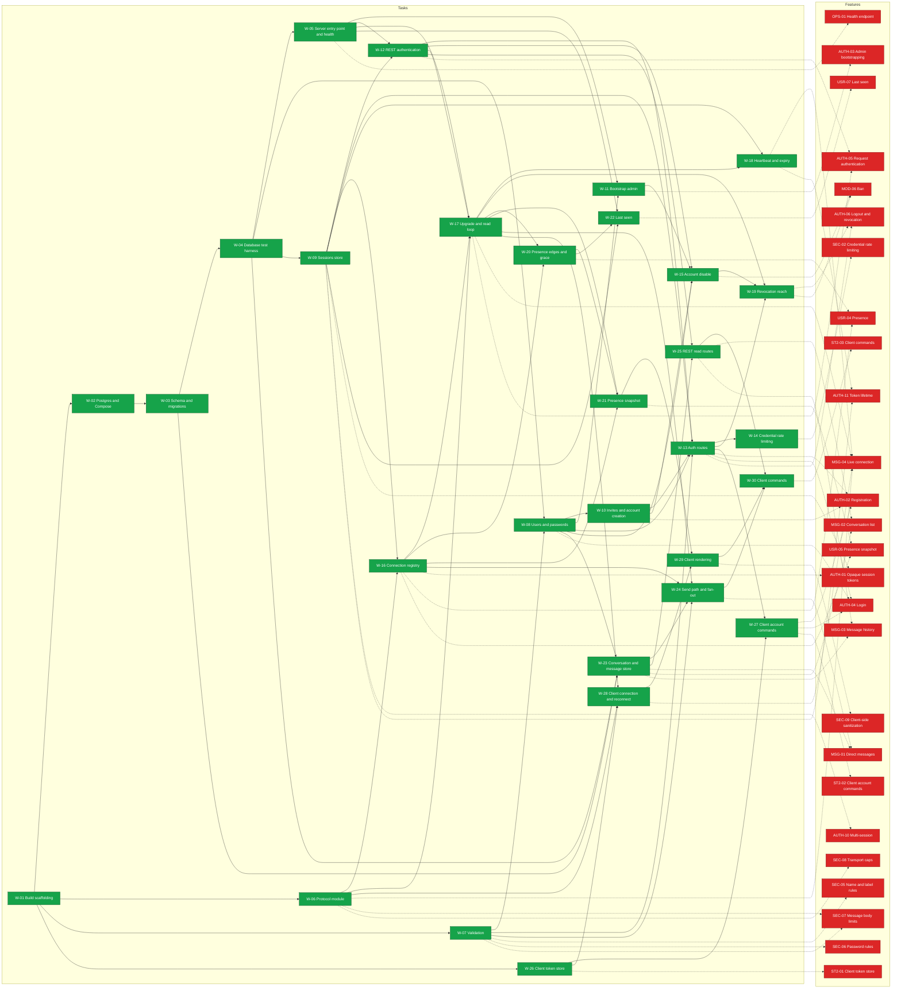

# Step 2 dependency map

*Generated by deps-graph.py from deps.md*

## By depth

```mermaid
graph TD
  W01[W-01 Build scaffolding]
  W02[W-02 Postgres and Compose]
  W06[W-06 Protocol module]
  W07[W-07 Validation]
  W26[W-26 Client token store]
  W03[W-03 Schema and migrations]
  SEC05[SEC-05 Name and label rules]
  SEC06[SEC-06 Password rules]
  SEC07[SEC-07 Message body limits]
  SEC08[SEC-08 Transport caps]
  ST201[ST2-01 Client token store]
  W04[W-04 Database test harness]
  W05[W-05 Server entry point and health]
  W08[W-08 Users and passwords]
  W09[W-09 Sessions store]
  W10[W-10 Invites and account creation]
  W11[W-11 Bootstrap admin]
  W12[W-12 REST authentication]
  W16[W-16 Connection registry]
  W23[W-23 Conversation and message store]
  AUTH10[AUTH-10 Multi-session]
  OPS01[OPS-01 Health endpoint]
  W13[W-13 Auth routes]
  W15[W-15 Account disable]
  W17[W-17 Upgrade and read loop]
  W25[W-25 REST read routes]
  AUTH01[AUTH-01 Opaque session tokens]
  AUTH03[AUTH-03 Admin bootstrapping]
  W14[W-14 Credential rate limiting]
  W18[W-18 Heartbeat and expiry]
  W19[W-19 Revocation reach]
  W20[W-20 Presence edges and grace]
  W24[W-24 Send path and fan-out]
  W27[W-27 Client account commands]
  W28[W-28 Client connection and reconnect]
  AUTH05[AUTH-05 Request authentication]
  MSG02[MSG-02 Conversation list]
  MSG03[MSG-03 Message history]
  W21[W-21 Presence snapshot]
  W22[W-22 Last seen]
  AUTH02[AUTH-02 Registration]
  AUTH04[AUTH-04 Login]
  AUTH06[AUTH-06 Logout and revocation]
  AUTH11[AUTH-11 Token lifetime]
  MOD06[MOD-06 Ban]
  MSG01[MSG-01 Direct messages]
  MSG04[MSG-04 Live connection]
  SEC02[SEC-02 Credential rate limiting]
  ST202[ST2-02 Client account commands]
  USR04[USR-04 Presence]
  W29[W-29 Client rendering]
  USR05[USR-05 Presence snapshot]
  USR07[USR-07 Last seen]
  W30[W-30 Client commands]
  SEC09[SEC-09 Client-side sanitization]
  ST203[ST2-03 Client commands]

  W01 --> W02
  W01 --> W06
  W01 --> W07
  W01 --> W26
  W02 --> W03
  W03 --> W04
  W03 --> W23
  W04 --> W05
  W04 --> W08
  W04 --> W09
  W04 --> W23
  W05 --> W11
  W05 --> W12
  W05 --> W17
  W05 --> W22
  W06 --> W16
  W06 --> W17
  W06 --> W28
  W07 --> W08
  W07 --> W13
  W07 --> W24
  W08 --> W10
  W08 --> W11
  W08 --> W13
  W08 --> W15
  W08 --> W23
  W09 --> W12
  W09 --> W13
  W09 --> W16
  W09 --> W18
  W09 --> W22
  W10 --> W13
  W10 --> W15
  W11 --> W15
  W12 --> W13
  W12 --> W15
  W12 --> W17
  W12 --> W25
  W13 --> W14
  W13 --> W19
  W13 --> W27
  W15 --> W19
  W16 --> W17
  W16 --> W20
  W16 --> W21
  W16 --> W24
  W17 --> W18
  W17 --> W19
  W17 --> W20
  W17 --> W21
  W17 --> W24
  W17 --> W28
  W20 --> W21
  W20 --> W22
  W21 --> W29
  W23 --> W24
  W23 --> W25
  W24 --> W30
  W25 --> W30
  W26 --> W27
  W26 --> W28
  W28 --> W29
  W29 --> W30
  W23 -.-> MSG01
  W24 -.-> MSG01
  W23 -.-> MSG02
  W25 -.-> MSG02
  W23 -.-> MSG03
  W25 -.-> MSG03
  W06 -.-> MSG04
  W17 -.-> MSG04
  W18 -.-> MSG04
  W28 -.-> MSG04
  W09 -.-> AUTH01
  W16 -.-> AUTH01
  W10 -.-> AUTH02
  W13 -.-> AUTH02
  W27 -.-> AUTH02
  W11 -.-> AUTH03
  W08 -.-> AUTH04
  W13 -.-> AUTH04
  W27 -.-> AUTH04
  W12 -.-> AUTH05
  W17 -.-> AUTH05
  W13 -.-> AUTH06
  W19 -.-> AUTH06
  W09 -.-> AUTH10
  W09 -.-> AUTH11
  W18 -.-> AUTH11
  W16 -.-> USR04
  W20 -.-> USR04
  W16 -.-> USR05
  W21 -.-> USR05
  W22 -.-> USR07
  W15 -.-> MOD06
  W19 -.-> MOD06
  W14 -.-> SEC02
  W07 -.-> SEC05
  W07 -.-> SEC06
  W06 -.-> SEC07
  W07 -.-> SEC07
  W06 -.-> SEC08
  W29 -.-> SEC09
  W05 -.-> OPS01
  W26 -.-> ST201
  W27 -.-> ST202
  W30 -.-> ST203

  classDef task fill:#16a34a,stroke:#14532d,stroke-width:1px,color:#ffffff
  classDef feature fill:#dc2626,stroke:#7f1d1d,stroke-width:1px,color:#ffffff
  class W01,W02,W06,W07,W26,W03,W04,W05,W08,W09,W10,W11,W12,W16,W23,W13,W15,W17,W25,W14,W18,W19,W20,W24,W27,W28,W21,W22,W29,W30 task
  class SEC05,SEC06,SEC07,SEC08,ST201,AUTH10,OPS01,AUTH01,AUTH03,AUTH05,MSG02,MSG03,AUTH02,AUTH04,AUTH06,AUTH11,MOD06,MSG01,MSG04,SEC02,ST202,USR04,USR05,USR07,SEC09,ST203 feature
```

## Grouped by kind

```mermaid
graph LR
  subgraph Tasks
    W01[W-01 Build scaffolding]
    W02[W-02 Postgres and Compose]
    W03[W-03 Schema and migrations]
    W04[W-04 Database test harness]
    W05[W-05 Server entry point and health]
    W06[W-06 Protocol module]
    W07[W-07 Validation]
    W08[W-08 Users and passwords]
    W09[W-09 Sessions store]
    W10[W-10 Invites and account creation]
    W11[W-11 Bootstrap admin]
    W12[W-12 REST authentication]
    W13[W-13 Auth routes]
    W14[W-14 Credential rate limiting]
    W15[W-15 Account disable]
    W16[W-16 Connection registry]
    W17[W-17 Upgrade and read loop]
    W18[W-18 Heartbeat and expiry]
    W19[W-19 Revocation reach]
    W20[W-20 Presence edges and grace]
    W21[W-21 Presence snapshot]
    W22[W-22 Last seen]
    W23[W-23 Conversation and message store]
    W24[W-24 Send path and fan-out]
    W25[W-25 REST read routes]
    W26[W-26 Client token store]
    W27[W-27 Client account commands]
    W28[W-28 Client connection and reconnect]
    W29[W-29 Client rendering]
    W30[W-30 Client commands]
    W01 --> W02
    W01 --> W06
    W01 --> W07
    W01 --> W26
    W02 --> W03
    W03 --> W04
    W03 --> W23
    W04 --> W05
    W04 --> W08
    W04 --> W09
    W04 --> W23
    W05 --> W11
    W05 --> W12
    W05 --> W17
    W05 --> W22
    W06 --> W16
    W06 --> W17
    W06 --> W28
    W07 --> W08
    W07 --> W13
    W07 --> W24
    W08 --> W10
    W08 --> W11
    W08 --> W13
    W08 --> W15
    W08 --> W23
    W09 --> W12
    W09 --> W13
    W09 --> W16
    W09 --> W18
    W09 --> W22
    W10 --> W13
    W10 --> W15
    W11 --> W15
    W12 --> W13
    W12 --> W15
    W12 --> W17
    W12 --> W25
    W13 --> W14
    W13 --> W19
    W13 --> W27
    W15 --> W19
    W16 --> W17
    W16 --> W20
    W16 --> W21
    W16 --> W24
    W17 --> W18
    W17 --> W19
    W17 --> W20
    W17 --> W21
    W17 --> W24
    W17 --> W28
    W20 --> W21
    W20 --> W22
    W21 --> W29
    W23 --> W24
    W23 --> W25
    W24 --> W30
    W25 --> W30
    W26 --> W27
    W26 --> W28
    W28 --> W29
    W29 --> W30
  end

  subgraph Features
    MSG01[MSG-01 Direct messages]
    MSG02[MSG-02 Conversation list]
    MSG03[MSG-03 Message history]
    MSG04[MSG-04 Live connection]
    AUTH01[AUTH-01 Opaque session tokens]
    AUTH02[AUTH-02 Registration]
    AUTH03[AUTH-03 Admin bootstrapping]
    AUTH04[AUTH-04 Login]
    AUTH05[AUTH-05 Request authentication]
    AUTH06[AUTH-06 Logout and revocation]
    AUTH10[AUTH-10 Multi-session]
    AUTH11[AUTH-11 Token lifetime]
    USR04[USR-04 Presence]
    USR05[USR-05 Presence snapshot]
    USR07[USR-07 Last seen]
    MOD06[MOD-06 Ban]
    SEC02[SEC-02 Credential rate limiting]
    SEC05[SEC-05 Name and label rules]
    SEC06[SEC-06 Password rules]
    SEC07[SEC-07 Message body limits]
    SEC08[SEC-08 Transport caps]
    SEC09[SEC-09 Client-side sanitization]
    OPS01[OPS-01 Health endpoint]
    ST201[ST2-01 Client token store]
    ST202[ST2-02 Client account commands]
    ST203[ST2-03 Client commands]
  end

  W23 -.-> MSG01
  W24 -.-> MSG01
  W23 -.-> MSG02
  W25 -.-> MSG02
  W23 -.-> MSG03
  W25 -.-> MSG03
  W06 -.-> MSG04
  W17 -.-> MSG04
  W18 -.-> MSG04
  W28 -.-> MSG04
  W09 -.-> AUTH01
  W16 -.-> AUTH01
  W10 -.-> AUTH02
  W13 -.-> AUTH02
  W27 -.-> AUTH02
  W11 -.-> AUTH03
  W08 -.-> AUTH04
  W13 -.-> AUTH04
  W27 -.-> AUTH04
  W12 -.-> AUTH05
  W17 -.-> AUTH05
  W13 -.-> AUTH06
  W19 -.-> AUTH06
  W09 -.-> AUTH10
  W09 -.-> AUTH11
  W18 -.-> AUTH11
  W16 -.-> USR04
  W20 -.-> USR04
  W16 -.-> USR05
  W21 -.-> USR05
  W22 -.-> USR07
  W15 -.-> MOD06
  W19 -.-> MOD06
  W14 -.-> SEC02
  W07 -.-> SEC05
  W07 -.-> SEC06
  W06 -.-> SEC07
  W07 -.-> SEC07
  W06 -.-> SEC08
  W29 -.-> SEC09
  W05 -.-> OPS01
  W26 -.-> ST201
  W27 -.-> ST202
  W30 -.-> ST203

  classDef task fill:#16a34a,stroke:#14532d,stroke-width:1px,color:#ffffff
  classDef feature fill:#dc2626,stroke:#7f1d1d,stroke-width:1px,color:#ffffff
  class W01,W02,W06,W07,W26,W03,W04,W05,W08,W09,W10,W11,W12,W16,W23,W13,W15,W17,W25,W14,W18,W19,W20,W24,W27,W28,W21,W22,W29,W30 task
  class SEC05,SEC06,SEC07,SEC08,ST201,AUTH10,OPS01,AUTH01,AUTH03,AUTH05,MSG02,MSG03,AUTH02,AUTH04,AUTH06,AUTH11,MOD06,MSG01,MSG04,SEC02,ST202,USR04,USR05,USR07,SEC09,ST203 feature
```
